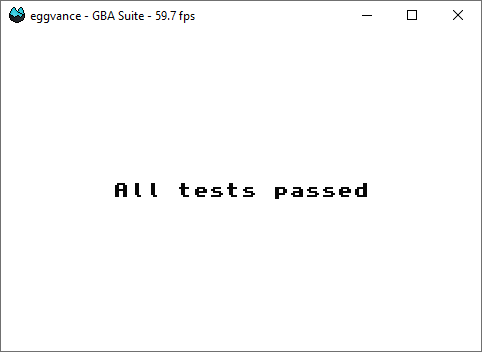

# GBA Tests
A collection of Game Boy Advance tests.

## Usage
Each ROM contains multiple tests. Either all of them pass or the number of the first failed one is displayed on the screen (background mode 4 is required). You can reference the source code for the expected result. Feel free to open an issue if something is unclear.

## Build
ROMs can be assembled with [FASMARM](https://arm.flatassembler.net/).
